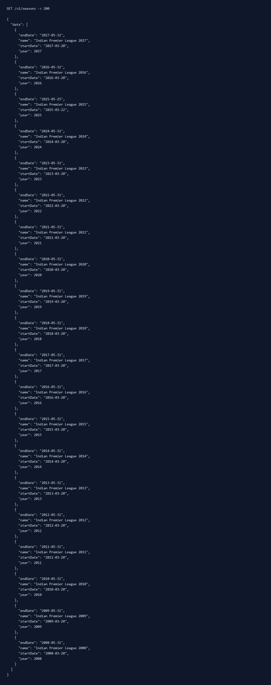
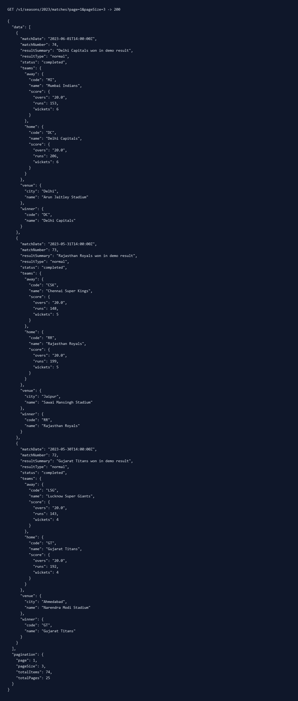
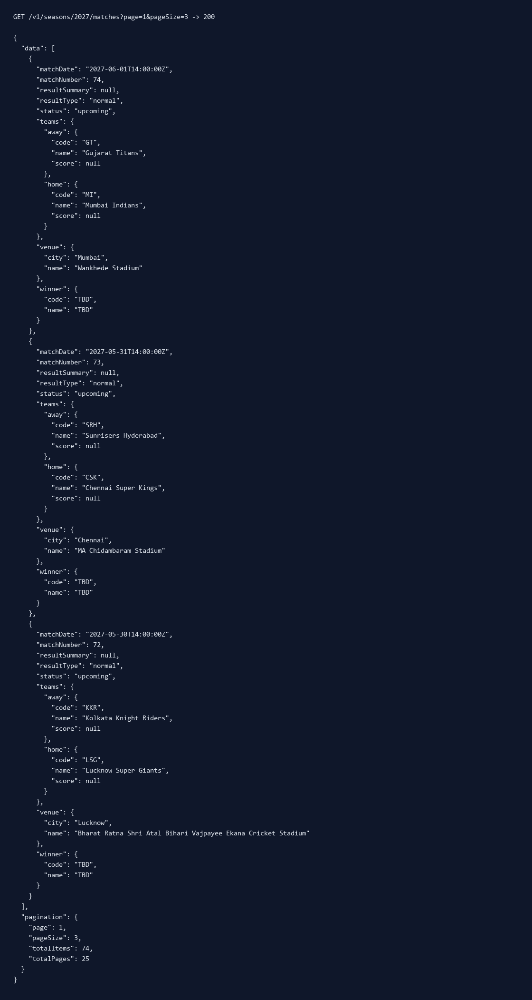
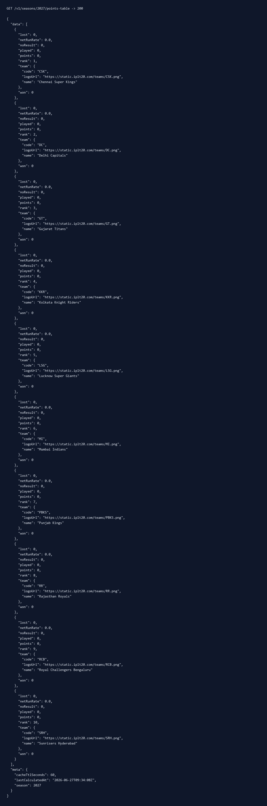
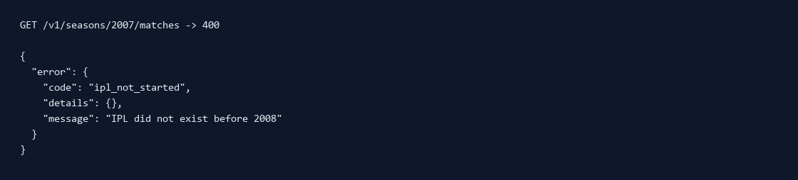
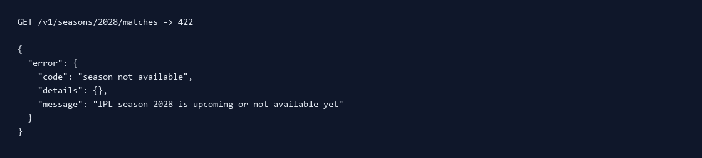

# IPL Platform API Design

This repository is written for an AI coding agent as the primary reader. Given `schema.sql`, `api.md`, and this README, an agent should be able to generate or maintain a working backend for the IPL Matches, Points Table, and Teams/Squad sections without asking follow-up questions.

The repo also includes a runnable reference implementation:

- Flask backend in `backend/`
- SQLite local runtime database in `backend/schema.sqlite.sql`
- React + Tailwind frontend in `frontend/`

## Demo Data Coverage

The runnable backend creates deterministic demo data for all valid IPL seasons:

- `2008` to `2026`: 74 completed demo matches per season with winners, scores, standings, and NRR.
- `2027`: 74 scheduled upcoming matches, no scores yet, winner shown as `TBD`, and points table initialized alphabetically with all teams on `0` played, `0` points, and `0.000` NRR.
- Before `2008`: returns a known `ipl_not_started` error because IPL did not exist.
- After `2027`: returns a known `season_not_available` error because those seasons are not available yet.

The generated match data is intentionally demo data for API behavior and evaluation, not official historical IPL score data.

## Problem Scope

Build the data layer and REST API contracts for these IPL website tabs:

- Matches / Results: paginated season match list with teams, venue, winner, scores, and status.
- Points Table: ranked season table with played, won, lost, no result, points, and net run rate.
- Teams & Squad: team profile with home city, captain, logo, and season squad with player roles.

The original design deliverables are:

- `schema.sql`: PostgreSQL relational schema.
- `api.md`: REST API contracts and JSON examples.
- `README.md`: assumptions, implementation instructions, and design reasoning for an AI agent.

## Core Assumptions

- A season is represented by `seasons.year`, for example `2025`.
- A team has stable franchise data in `teams`; season-specific participation and captain data live in `team_seasons`.
- A squad is season-specific because players and captains change between seasons.
- A match belongs to exactly one season and has exactly two teams.
- Match status is one of `upcoming`, `live`, or `completed`.
- Completed matches may have no winner when the result is `no_result` or `abandoned`.
- Scores are stored per innings in `innings_scores`, not as preformatted text on the match row.
- Public API identifiers are `seasonYear`, `teamCode`, and `matchNumber`; internal database IDs should stay mostly hidden.
- Player roles are limited to `batter`, `bowler`, `all-rounder`, and `WK`.

## Database Design

Use `schema.sql` as the canonical RDBMS design. It is PostgreSQL because the assignment prefers PostgreSQL or MySQL.

Important tables:

- `seasons`: IPL season metadata.
- `teams`: stable franchise profile fields such as code, name, home city, logo.
- `venues`: normalized venue details.
- `players`: reusable player master table.
- `team_seasons`: season-specific team participation and captain.
- `squad_members`: season-specific player membership and role.
- `matches`: schedule, teams, status, winner, and result metadata.
- `innings_scores`: score rows per innings.
- `team_standings`: materialized read model for fast points table reads.

Table purpose in brief:

| Table | Why it exists |
| --- | --- |
| `seasons` | Keeps every endpoint season-scoped and supports historical/upcoming season behavior. |
| `teams` | Stores stable franchise data once instead of repeating team names, cities, and logos. |
| `venues` | Normalizes stadium data so match rows only reference a venue. |
| `players` | Creates one reusable player record that can appear in different season squads. |
| `team_seasons` | Connects teams to seasons and stores season-specific captain data. |
| `squad_members` | Models player membership and role per team per season. |
| `matches` | Stores schedule, teams, status, result type, winner, and result summary. |
| `innings_scores` | Stores numeric score data needed for display, totals, and NRR calculation. |
| `team_standings` | Stores the computed points table as a fast read model. |
| `standings_refresh_runs` | Audits scheduled standings refresh jobs and makes background updates observable. |

The schema is normalized so that:

- team details are not duplicated across matches,
- player details are not duplicated across squads,
- scores are queryable as numeric values,
- standings can be recalculated from match results,
- the API layer can be implemented mostly as joins plus response mapping.

## Runtime Database Choice

A `.sql` file is a script, not a database server. To use `schema.sql` directly, run a PostgreSQL server and execute the SQL against a database.

This repo uses SQLite for the runnable local backend because it lets the evaluator run the app without installing PostgreSQL. SQLite is still an RDBMS. The local SQLite schema mirrors the PostgreSQL design closely in `backend/schema.sqlite.sql`.

If converting the runnable backend to PostgreSQL:

- replace the SQLite connection helpers in `backend/app.py` with a PostgreSQL driver such as `psycopg`,
- execute `schema.sql` in the target database,
- convert `backend/seed.sql` to PostgreSQL if needed,
- keep the API responses unchanged.

## Points Table Derivation

`team_standings` is a derived read model. It should be recalculated after completed match results change.

Recommended calculation rules:

- A win gives `2` points.
- A loss gives `0` points.
- No result or abandoned gives `1` point to each team.
- `matches_played = won + lost + no_result`.
- Ranking order is points descending, then net run rate descending, then wins descending.
- Persist the final rank in `team_standings.rank` for simple API reads.

Net run rate should be derived from innings data:

```text
NRR = (total runs scored / total overs faced) - (total runs conceded / total overs bowled)
```

Use legal balls for the denominator. For example, `116` balls is `19.3333` overs for calculation and `"19.2"` only for display. Keep calculation values numeric and format display values in the API layer.

Why store `team_standings` if it can be derived?

- The points table is read-heavy.
- Ranking should be fast and deterministic.
- It avoids recomputing standings on every page load.
- It is still explainable because every stored value can be traced back to completed matches and innings.

## Scheduled Standings Refresh Bonus

The repo includes `backend/refresh_standings.py` as the job entry point for a daily standings refresh.

Recommended production schedule:

```text
Every day at 09:00 local time during the IPL season:
1. Find seasons with recently completed matches.
2. Compare completed match counts against team_standings.matches_played.
3. Recompute standings from matches and innings_scores.
4. Update team_standings.
5. Write an audit row to standings_refresh_runs.
6. Clear cached points-table responses.
```

The implementation uses full recomputation per season instead of fragile incremental updates. That is safer because if a score is corrected after a match, the next refresh produces the correct table from source data.

## REST API Implementation

Implement the endpoints exactly as documented in `api.md`:

- `GET /v1/seasons`
- `GET /v1/seasons/{seasonYear}/matches`
- `GET /v1/seasons/{seasonYear}/matches/{matchNumber}`
- `GET /v1/seasons/{seasonYear}/points-table`
- `GET /v1/seasons/{seasonYear}/teams`
- `GET /v1/seasons/{seasonYear}/teams/{teamCode}`

Use camelCase in JSON responses and snake_case in database columns.

Return this error shape for all non-2xx responses:

```json
{
  "error": {
    "code": "not_found",
    "message": "Season 2099 was not found",
    "details": {}
  }
}
```

This is a read-only API for the assignment. No `POST`, `PUT`, `PATCH`, or `DELETE` endpoints are required because the problem statement asks for the public website read surfaces only: Matches, Points Table, and Teams/Squad. Admin ingestion APIs could be added later, but they are intentionally outside this scope.

## Backend Concepts Included

The implementation includes only backend concepts that are relevant to this assignment.

Server-side pagination:

- Used on `GET /v1/seasons/{seasonYear}/matches`.
- Prevents loading an entire season result set at once.
- Exposes `page`, `pageSize`, `totalItems`, and `totalPages`.

TTL caching:

- Used for points table and team/squad reads.
- These endpoints are read-heavy and change less frequently than live match scores.
- Default TTL is controlled by `CACHE_TTL_SECONDS`.
- Live match listing is intentionally not cached in the reference implementation.

Materialized read model:

- `team_standings` stores computed table rows.
- This keeps the points table endpoint simple and fast.
- The source of truth remains `matches` and `innings_scores`.

Infinite scroll:

- Implemented in the React frontend for Matches.
- It demonstrates why the paginated backend contract matters.
- It is a frontend UX decision built on top of server-side pagination, not a replacement for pagination.

Validation and HTTP semantics:

- Invalid query or path parameters return `400`.
- Missing seasons, teams, or matches return `404`.
- Successful reads return `200`.
- IPL years before 2008 return `400` with `ipl_not_started`.
- Years after the scheduled season return `422` with `season_not_available`.

## What Was Considered Beyond The Problem Statement

The problem statement asks for schema and API contracts. These extra decisions were included because they improve correctness, performance, maintainability, or agent implementability without adding unnecessary complexity.

| Addition | Technical importance |
| --- | --- |
| Season-aware team modeling through `team_seasons` | Captains and squads change across seasons, so this avoids corrupting historical team data when a later season changes. |
| Season-aware squads through `squad_members` | Players can move franchises or have different roles over time, so squad membership must not live directly on `players` or `teams`. |
| Separate `venues` table | Prevents repeated stadium/city text in every match row and makes venue filters or future venue metadata easy to add. |
| Numeric `innings_scores` table | Enables score display, run-rate math, and NRR calculation from source data instead of parsing strings like `172/6 (19.2)`. |
| Separate `status` and `result_type` | `status` answers whether a match is upcoming/live/completed; `result_type` answers how it ended. Keeping them separate handles normal, no-result, abandoned, and tie cases cleanly. |
| Stable `teamCode` API identifiers | Clients can call `/teams/CSK` or filter by `teamCode=MI` without depending on internal database IDs. |
| Server-side pagination | The matches endpoint can support full 74-match seasons without forcing clients to load every row at once. |
| TTL caching | Points table and team/squad endpoints are read-heavy and relatively stable, so a short in-memory TTL reduces repeated joins and response formatting. |
| No cache on live match listing | Match status and score can change frequently, so this avoids serving stale live data. |
| Materialized `team_standings` read model | Points table reads are fast, while the canonical data still lives in `matches` and `innings_scores`. |
| Scheduled 9 AM standings refresh | A background job can recompute standings after completed matches, compare match counts, update NRR/points, and audit each run in `standings_refresh_runs`. |
| Known season error handling | Requests before 2008 return `ipl_not_started`; requests after the scheduled season return `season_not_available`, which is clearer than a generic 404. |
| 2027 schedule-only season | Demonstrates how an upcoming season can have fixtures ready while standings remain initialized at zero. |
| Indexes on common access paths | Season/date match listing, status filtering, standings ranking, and squad role lookup are indexed because those are natural API query patterns. |
| SQLite runtime plus PostgreSQL design schema | The app can run locally without PostgreSQL, while `schema.sql` still satisfies the preferred production RDBMS design. |
| React reference frontend | Infinite scroll and season switching show how the API contracts would power the actual IPL tabs. |

## API Response Screenshots

These screenshots are generated from real local API calls using the Flask test client.

### Seasons



### 2023 Completed Matches



### 2027 Upcoming Schedule



### 2027 Empty Points Table



### Known Error Before IPL Started



### Known Error For Unavailable Future Season



## Run Backend

```bash
cd backend
python -m venv .venv
.venv\Scripts\activate
pip install -r requirements.txt
python app.py
```

Backend URL:

```text
http://127.0.0.1:5000
```

Useful checks:

```text
http://127.0.0.1:5000/health
http://127.0.0.1:5000/v1/seasons
http://127.0.0.1:5000/v1/seasons/2025/matches?page=1&pageSize=3
http://127.0.0.1:5000/v1/seasons/2025/points-table
http://127.0.0.1:5000/v1/seasons/2025/teams/CSK
http://127.0.0.1:5000/v1/seasons/2027/matches?page=1&pageSize=3
http://127.0.0.1:5000/v1/seasons/2028/matches
```

## Run Frontend

```bash
cd frontend
npm install
npm run dev
```

Frontend URL:

```text
http://127.0.0.1:5173
```

## Agent Implementation Checklist

When generating a production backend from this repo:

- Run the PostgreSQL schema from `schema.sql`.
- Seed teams, venues, players, season squads, matches, innings, and standings.
- Implement the exact contracts from `api.md`.
- Keep response field names camelCase.
- Add tests for pagination, invalid parameters, 404s, standings ordering, and squad responses.
- Recompute `team_standings` whenever completed match data changes.
- Do not calculate NRR from display overs strings; calculate from legal balls.
- Keep caching short-lived and invalidate it after standings or squad writes.
